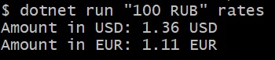
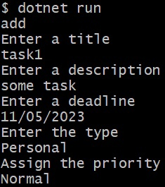
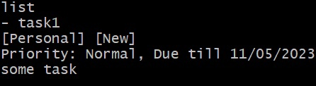
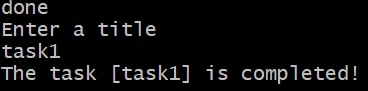

# Day02
## Note
**Requires .NET 6**
## ex00 - Currency converter
### Run
```dotnet run {amount} {path}```

Example:



## ex01 - Task list
### Run
```dotnet run```

Commands:
  * add - add new task to list
  * list - show tasks
  * done - make task completed
  * wontdo - make task irrelevant

Example:






