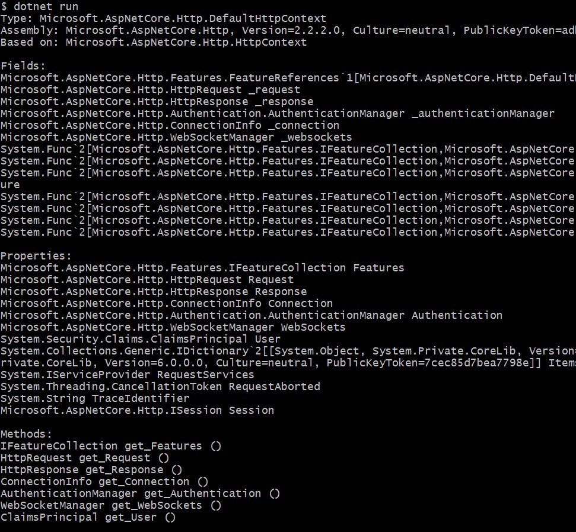
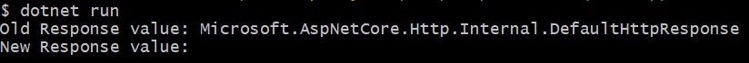
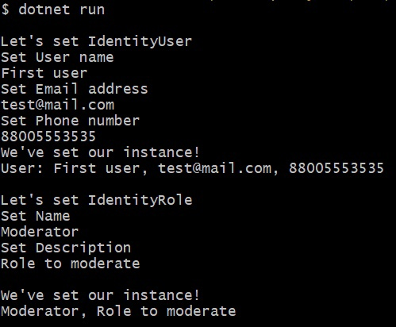
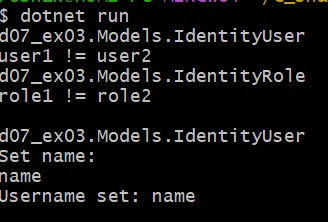

# Day07 - Reflection
## Note
**Requires .NET 6**

## ex00 - DefaultHttpContext Info
### Run
* ```cd d07/d07_ex00/```
* ```dotnet run```

Example:



## ex01 - Breaking the rules
### Run
* ```cd d07/d07_ex01/```
* ```dotnet run```

Example:




## ex02 - Autofill
### Run
* ```cd d07/d07_ex02/```
* ```dotnet run```

Example:



## ex03 - Creating objects using reflection
### Run
* ```cd d07/d07_ex03/```
* ```dotnet run```

Example:


